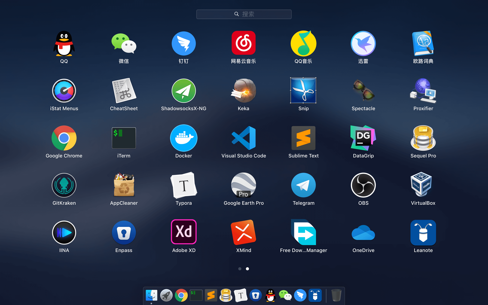

# mac-apps
Mac 上好用的软件

---

### 常用软件

- [Google Chrome](https://www.google.com/intl/zh-CN/chrome/) ~ 速度快，功能强大，吃内存
- [Typora](https://typora.io/#download) ~ Markdown 编辑器

### 聊天通讯

- [QQ](https://im.qq.com/macqq/) ~ 老牌聊天软件，工作交流软件
- [微信](https://mac.weixin.qq.com/) ~ 撩妹用的，有时也聊工作
- [钉钉](https://tms.dingtalk.com/markets/dingtalk/download) ~ 上班打卡、跟领导汇报工作用
- [Telegram](https://macos.telegram.org/) ~ 要科学上网才能用的软件，据说聊天内容不被政府监管

### 系统工具

- [搜狗五笔输入法](https://pinyin.sogou.com/mac/wubi.php) ~ 五笔输入法
- [iStat Menus](https://bjango.com/mac/istatmenus/) ~ 系统监控软件，监控 cpu、内存、磁盘、网速等等
- [Enpass](https://www.enpass.io/downloads/) ~ 密码管理软件
- [Keka](https://www.keka.io/zh-cn/) ~ Mac 上好用的压缩文件管理软件
- [Itsycal](https://www.mowglii.com/itsycal/) ~ 顶部菜单栏日历插件
- [Aerial](https://github.com/JohnCoates/Aerial/releases) ~ 开源的屏保软件，多屏 Spanned 模式很酷
- [Snip](https://snip.qq.com/) ~ 屏幕截图软件，可以滚动截屏
- [CheatSheet](https://mediaatelier.com/CheatSheet/) ~ 查看软件快捷键工具，一键查看软件所有快捷键
- [AppCleaner](https://freemacsoft.net/appcleaner/) ~ 软件卸载工具，不再为卸载软件后有残留文件发愁
- [Spectacle](https://www.spectacleapp.com/) ~ 窗口缩放排列工具
- [ShadowsocksX-NG](https://github.com/shadowsocks/ShadowsocksX-NG/releases) ~ 科学上网工具
- [Proxifier](https://www.proxifier.com/download/) ~ 一款功能非常强大的 socks5 客户端

### 开发工具

- [Visual Studio Code](https://code.visualstudio.com/) ~ 文本编辑器的后起之秀
- [Sublime Text](http://www.sublimetext.com/) ~ 轻巧、插件丰富的文本编辑器
- [PhpStorm](https://www.jetbrains.com/phpstorm/download/) ~ PHP 开发工具
- [GoLand](https://www.jetbrains.com/go/download/) ~ GoLang 开发工具
- [WebStrom](https://www.jetbrains.com/webstorm/download/) ~ Web 开发工具
- [iTerm](https://www.iterm2.com/downloads.html) ~ Mac 终端神器
- [brew](https://brew.sh/) ~ 包管理工具，安装软件、扩展很方便
- [Node.js](https://nodejs.org/zh-cn/) ~ 基于 Chrome V8 引擎的 JavaScript 运行环境
- [GitKraken](https://www.gitkraken.com/download) ~ Git 图形化操作工具
- [Postman](https://www.getpostman.com/downloads/) ~ 接口调试利器
- [Charles](https://www.charlesproxy.com/download/) ~ 抓包工具
- [Sequel Pro](https://www.sequelpro.com/) ~ 数据库工具
- [DataGrip](https://www.jetbrains.com/datagrip/) ~ 数据库工具
- [Docker](https://www.docker.com/get-started) ~ Docker

### 图形工具

- [XMind](https://www.xmind.cn/zen/) ~ 思维导图工具
- [Adobe XD](https://www.adobe.com/cn/products/xd.html) ~ 画原型图用，操作方便，功能强大

### 音乐播放

- [网易云音乐](https://music.163.com/#/download) ~ 个性化推荐，私人FM，根据用户习惯自动匹配歌曲，歌曲评论是一大特色
- [QQ音乐](https://y.qq.com/download/mac.html) ~ QQ音乐
- [虾米音乐](https://emumo.xiami.com/apps/mobile) ~ 虾米音乐
- [酷狗音乐](http://download.kugou.com/) ~ 酷狗音乐

### 视频播放

- [IINA](https://iina.io/) ~ Mac 上最牛的视频播放软件，一个打一片那种

### 其他软件

- [欧路词典](https://www.eudic.net/) ~ 强大的翻译软件
- [Free Download Manager](https://www.freedownloadmanager.org/zh/) ~ 下载工具
- [Leanote](http://app.leanote.com/) ~ 蚂蚁笔记，开源可自己搭建服务器
- [OneDrive](https://onedrive.live.com/about/zh-CN/download/) ~ 微软网盘
- [百度网盘](https://pan.baidu.com/download#pan) ~ 百度网盘
- [0xED](https://www.suavetech.com/0xed/) ~ 十六进制编辑器
- [Google Earth Pro](https://www.google.com/earth/versions/#earth-pro) ~ 地图软件，高分辨率卫星地图
- [OBS](https://obsproject.com/) ~ 直播推流，屏幕录像，功能强大
